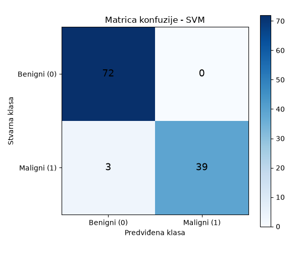

# Breast Cancer Diagnostic Classification

Projekat iz predmeta Softverski algoritmi u sistemima automatskog upravljanja - 
klasifikacija tumora dojke (benigni/maligni) na osnovu numeričkih
karakteristika ćelijskog jezgra, korišćenjem Wisconsin Breast Cancer
dataset-a (569 uzoraka, 30 numeričkih atributa).

**Student:** Nikol Vidaković, RA232/2023, Fakultet tehničkih nauka, Novi Sad

Detaljna dokumentacija celog procesa, organizovana po fazama projekta, nalazi
se u [`documentation/project_documentation.pdf`](documentation/project_documentation.pdf).

## Struktura projekta

```
breast-cancer-project/
├── data/
│   └── data.csv                  # Wisconsin Breast Cancer dataset
├── src/
│   ├── train.py                  # učitavanje podataka, treniranje i evaluacija modela, export
│   └── predict.py                # predikcija na jednom novom primeru
├── app/
│   ├── ui.py                     # Streamlit aplikacija
│   └── api.py                    # FastAPI servis
├── models/
│   └── breast_cancer_svm.joblib  # sačuvan finalni model (scaler + SVM)
├── results/
│   ├── model_comparison.csv
│   ├── feature_importance.csv
│   └── figures/                  # grafici (EDA, matrica konfuzije, feature importance)
├── documentation/
│   └── project_documentation.pdf # detaljna dokumentacija po fazama projekta
└── README.md
```

## Pokretanje

Projekat koristi `uv` za upravljanje paketima.

**Instalacija zavisnosti**
```
uv sync
```

**Treniranje modela** (učitava podatke, trenira i poredi 5 algoritama, bira i
čuva finalni model)
```
uv run src/train.py
```

**Predikcija na jednom primeru** (koristi već sačuvan model)
```
uv run src/predict.py
```

**Streamlit aplikacija** (vizuelna forma za unos podataka i predikciju)
```
uv run streamlit run app/ui.py
```

**FastAPI servis** (REST API za predikciju)
```
uv run uvicorn app.api:app --reload
```
Interaktivna dokumentacija dostupna je na `http://127.0.0.1:8000/docs`.

## Pristup

Podaci su provereni na nedostajuće vrednosti i duplikate (0 u oba slučaja),
kolona `id` je uklonjena, a `diagnosis` je enkodirana (M → 1, B → 0), pri
čemu je maligni tumor postavljen kao pozitivna klasa zbog veće cene
propuštanja malignog slučaja u medicinskom kontekstu.

Podaci su podeljeni na trening (80%) i test (20%) skup uz stratifikaciju, a
atributi su skalirani (`StandardScaler`, fitovan isključivo na trening
skupu). Pet algoritama je upoređeno kroz petostruku stratifikovanu
unakrsnu validaciju (Logistička regresija, KNN, SVM, Stablo odlučivanja,
Random Forest), uz **recall** kao glavni kriterijum izbora: odabran jer
direktno odgovara na pitanje da li se propuštaju maligni slučajevi, što je
najrelevantnije pitanje za ovaj problem. Tri najbolja kandidata su dodatno
optimizovana kroz `GridSearchCV`.

## Rezultati

**Finalni model:** SVM (`C=10`, `kernel=rbf`)

| Metrika | CV (trening) | Test skup |
|---|---|---|
| Recall | 0.965 | 0.929 |
| Accuracy | 0.976 | 0.974 |
| F1 | 0.967 | 0.963 |
| ROC-AUC | 0.995 | 0.993 |

Matrica konfuzije na test skupu (114 pacijenata): 0 lažnih uzbuna, 3
propuštena maligna slučaja od ukupno 42.



**Najvažniji atributi** (procenjeno preko Random Forest-a, pošto SVM nema
ugrađenu meru važnosti atributa): `worst area`, `worst concave points`,
`worst radius`, `worst perimeter`, `mean concave points`. Detaljna tabela
dostupna u `results/feature_importance.csv`.

## Reference

Projekat je strukturno usklađen sa materijalima i primerima sa vežbi
predmeta Softverski algoritmi u sistemima automatskog upravljanja, kao i sa zahtevima iz
projektnog pravilnika.
